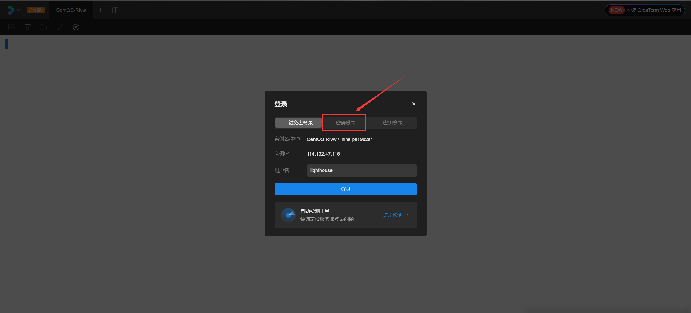

# 宝塔部署Django项目

---

## 部署概述

当我们完成一个网页的开发以后，我们只能在本机来访问该网站，别的用户是不能访问该网站的，所以我们需要将该项目部署到公网上面，这样才能让别的用户访问我们的网站。

## 部署前的准备

部署前需要准备好一台云服务器，绝大多数的云服务器都会提供一个公网的IP和端口号，我们需要把Django项目部署到这台云服务器上面，这样就可以给其他用户来访问我们搭建的网站了。

云服务器可以通过一些渠道进行购买，这里推荐使用阿里云或者腾讯云的服务器，这两个商家提供的服务器都差不多，但是腾讯云的活动会丰富一些。对于学生来说，优惠很高。所以我这里是在腾讯云买的一台云服务器（镜像为CentOS 7.6），112元买的一年，并且只有这一次购买的机会。

## 云服务器基本配置

购买完毕服务器后（这里是腾讯云），点击头像进入个人中心，左上角有个“云产品”的按钮，然后找到“轻量应用服务器”，点击即可查看到自己购买的云服务器信息。

购买完毕后可以对服务器进行相应的配置，例如关机、重启、修改密码等操作。

## 安装宝塔面板

1. 找到自己的服务器，点击登录。


2. 此时会跳转到一个新的页面，我们选择密码登录，接着输入用户名和密码点击登录即可。



3. 登录后会进入一个linux的操作面板，我们输入以下命令（centos镜像才使用该命令）后按回车。

```
yum install -y wget && wget -O install.sh http://download.bt.cn/install/install_6.0.sh && sh install.sh ed8484bec
```

4. 安装过程中所有提示选择“是”。
5. 安装完毕后会告诉我们宝塔的相关信息，我们需要记住这些信息用于进入宝塔面板。


6. 在这个提示下面，会有一个警告信息，告诉我们需要将该端口添加进服务器的防火墙中。
7. 回到服务器信息页面，点击防火墙。


8. 点击添加规则。


9. 在端口字段中填写刚刚的端口号并点击确认即可。


以上步骤的目的只是为了将宝塔面板安装到服务器上面，不管你使用什么方式，能安装好宝塔即可。

## 宝塔基本配置

1. 在服务器中安装宝塔后，我们进入外网面板地址。
2. 进入后会提示输入账号密码，这个账号密码就是安装完宝塔后提供的那个账号信息。


3. 点击登录后会弹出以下信息：


4. 我们选择Nginx对应的配置，Mysql版本根据项目的版本进行选择，默认的也可以。
5. 点击“一键安装”后等待大约10分钟后即可完成配置。

## 上传项目至服务器

1. 点击右侧的网站选项，选择Python，安装Python。


2. 选择相应的Python（这里选择的是Python3.10）版本再点击“安装”。


3. 安装完毕后会显示以下信息：


4. 在右边的栏目中选择“文件”，点击“上传”（可以上传目录也可以上传文件）。


5. 将项目压缩打包后加入上传目录，然后点击“开始上传”。


6. 上传完毕后点击解压（切记不要将所有文件解压到根目录下）。


7. 解压完毕后可将原安装包删除即可完成上传操作。


## 配置项目运行环境

1. 点击右侧“网站”，选择“添加Python项目”。


2. 选择项目路径


3. 填写相应的端口号，这里填的是8000，若项目目录中存在“requirements.txt”的文件，那么则会默认安装依赖包（若安装失败那么则需手动安装对应的模块），运行方式选择uwsgi。


4. 填写好相应的参数后点击提交按钮，此时会默认的给该项目分配一个虚拟环境。


5. 之后会看到项目已经在运行状态。


6. 进入该项目的终端（该终端即为该项目的虚拟环境），首次进入终端需要输入服务器的账号和密码，是服务器的账号和密码，不是宝塔的账号密码。


7. 输入pip list检查项目依赖的包或模块是否安装好。

```python
pip list
```

若相应的模块没有安装好，则还需执行以下命令或手动安装。

```python
pip install -r requirements.txt
```

手动安装（使用以下方法或者直接pip install）：


8. 确保Django项目中的“settings.py”文件中的这些配置修改为以下：

```python
DEBUG = False  # 关闭debug，避免出现的报错信息将服务器资源暴露。
ALLOWED_HOSTS = ['*']  # 当debug关闭后，一定要填写该字段，否则会报错。
STATIC_ROOT = BASE_DIR / 'static'  # 记得把STATICFILES_DIRS这个变量注释掉，因为这个是开发时的静态资源路径
```

9. 接着使用静态文件收集命令将项目的所有静态资源收集到static目录下。在使用该命令之前请确保“settings.py”文件中包含“STATIC_ROOT”字段，因为这条命令会将所有静态资源文件都放至该目录下。

```powershell
python3 manage.py collectstatic  # 注意是python3，不是python
```

10. 到这里项目的基本配置就完毕了。

## 解决mysqlclient安装失败的问题

因为“mysqlclient”这个模块是用C语言来写的，安装失败可能是因为相应的C语言模块缺失，所以会导致安装失败。

假如该模块实在是不能安装的话，可以“pymysql”来代替。该模块完全由Python编写，所以不会出现什么模块缺失的问题，但是在性能上肯定没有前者这么优秀。

1. 在项目虚拟环境中执行安装命令安装好pymysql。

```python
pip install pymysql
```

2. 在项目的主目录（settings.py对应的目录）下，打开init.py，编写以下代码：

```python
import pymysql

pymysql.install_as_MySQLdb()
```

3. 点击保存后即可代替mysqlclient。

*参考：https://blog.csdn.net/ybw_2569/article/details/105073616*

## 配置项目数据库信息

1. 选择“数据库”，点击“添加数据库”。


2. 配置好相关信息：数据库的名字和用户名必须保持一致，编码选择utf-8，密码是root密码。


3. 点击提交后即可看到该页面。


4. 在项目的“settings.py”文件中配置新的数据库信息：

```python
DATABASES = {
    "default": {
        "ENGINE": "django.db.backends.mysql",
        "NAME": 'home_appliances',  # 新的数据库名字
        "USER": 'root',  # 新的数据库账号
        "PASSWORD": '000000',  # 新的数据库密码
        "PORT": '3306',
        "HOST": 'localhost'
    }
}
```

5. 迁移数据表（每个app必须要有迁移文件，没有的话要先创建迁移文件）。


6. 点击终端后输入迁移命令。

```python
python3 manage.py migrate
```

7. 迁移完毕后，点击数据库，再点击“导入”，导入相关的sql文件，即可向数据库中插入本地数据，没有的话该步骤可以省略。


8. 至此，数据库的迁移已经完成。

## 以uWSGI作为Django的Web服务器

在完成服务器的转交之前，我们需要了解几个web服务器的基本概念。

### WSGI

WSGI（web server gateway interface），是一种web服务器的网关接口。它是一个web服务器与web应用之间的一种通信规范。有了这个规范，Python Web应用就可以轻松的部署在不同的web服务器中。

### uwsgi

它和WSGI一样，是一种通信协议。

### uWSGI

它是一个web服务器，遵循WSGI、uwsgi和http协议。主要用于接收前端发送的动态请求并转发请求给web应用处理。也就是说，在部署项目的时候，我们需要把请求转交给uWSGI来处理，而uWSGI则会打包请求发送给web应用进行处理。所以，在项目上线的时候，我们的后端服务器就由原来的Django自带的服务器换成了uWSGI服务器。

### 配置uWSGI

实际上，当你完成了上述操作的时候，宝塔已经帮我们配置好了uWSGI。在项目的根目录下，会多出这几个文件。其中，uwsgi.ini这个文件就是配置文件，我们也不需要去修改它（宝塔已经帮配置好了），否则项目可能会发生异常而不能正常启动或关闭。


那么此时这个项目使用的web服务器就不再是Django自带的web服务器了，而是uWSGI，那么这时候请求就成功的转交给了uWSGI了。

双击打开uwsgi.ini这个文件，会看到有一个http的字段，它记录了项目的端口的ip和端口号，这个端口号就是我们起初创建Python项目时填写的端口号。


我们再打开同级目录下的uwsgi.pid这个文件。如果你看到了一个数，这个数代表着这个服务器的进程ID，表示你的uWSGI服务器已经启动了。


**<u>倘若你在文件里没有看到这个数，那么就需要手动启动uwsgi服务。如果已经启动，则忽略以下步骤</u>**。

进入项目对应的终端，确保目录下包含以下文件：


输入以下命令即可开启uwsgi服务。

```
uwsgi --ini uwsgi.ini
```

相应的，输入以下命令即可关闭uwsgi服务。

```
uwsgi --stop uwsgi.pid
```

那么到此就相当于在开发时运行了启动服务的命令，即python manage.py runserver。

到这里你就可以使用公网ip+项目端口号来访问这个网站了（确保云服务器和宝塔面板都对该端口进行开放）。

*注意：如果你的项目到这里就已经结束了，那么一定要确保uwsgi.ini内的端口要在云服务器和宝塔面板开放，否则是不能在公网中访问的。*

## Nginx作为项目的反向代理服务器

当我们完成uwsgi的web服务器代理时，能够正常访问网页。但是，我们会发现，网页所有的静态资源都是不存在的。因为uWSGI服务器不是很擅长帮我们处理静态资源，这时候，我们就需要使用Nginx来反向代理uWSGI了。

### 反向代理原理

当一个用户发起一个static开头的请求路径时，我们需要交给Nginx来处理，而静态资源之外的请求，我们需要交给uWSGI来处理，之后uWSGI会调用wsgi.py文件下的application，并将处理后的结果返回给用户。

当Nginx收到静态资源请求的时候，会提前把项目的静态资源放到Nginx对应的存储路径下，之后会根据配置进行寻找对应的静态资源。


### 开启反向代理

1. 首先在宝塔面板打开软件商店，确保已经安装了Nginx，找到Nginx并打开设置。


2. 点击“配置修改”。


3. 找到“http”这个字段。


4. 在“http”域中添加以下配置信息：

```nginx
server {
	listen 8001;  # 给Nginx的端口号，不能是项目已经使用的端口号，必须是未使用的端口号，并且在防火墙中已经开放该端口。
	server_name 114.132.47.115;  # 公网ip，有域名就可以写域名。
    # 静态资源以外的请求交给uwsgi
	location / {
		include /www/server/nginx/conf/uwsgi_params;  # 请求参数交给uwsgi
		uwsgi_pass 127.0.0.1:9091;  # 端口要和uwsgi里配置的一样
	}
    # 静态资源请求交给Nginx
	location /static/ {
		alias /www/wwwroot/ProjetcName/static/; # 静态资源路径
	}
}
```

5. 此时还需要将项目的通信方式由默认的“http”改成“socket”，点击保存。


6. 在uwsgi配置文件中添加字段：

```nginx
buffer-size = 32768  # 接收的最大请求资源
```

7. 重启项目并通过公网ip+Nginx配置的端口号即可访问该网址。
8. 至此，整个Django项目部署完成！

## 解决静态文件无法显示问题

当你已经设置好Nginx反向代理的时候，如果你发现你的网页有些图片能够正常显示，有些图片不能显示，那么有可能是你的项目在打包压缩的时候，图片的名字包含了中文，解压的时候不能被正确解压，从而导致图片的名字异常。就像下面这种情况一样。


解决办法很简单，你只需要将这些图片全部删了，然后再单独导入一遍即可。

## 配置upstream——实现服务器负载均衡

当一个网站处理大量请求的时候，并且网站只开放了一个端口号时，就会给这个网站造成巨大的压力。那么有没有什么办法可以给一个网站打开多个端口呢，答案肯定是有的。

uwsgi.ini是启动项目的一个重要的文件，但是这个文件只能携带一个端口，所以我们可以再次创建一个这样的文件，文件里的端口号必须未被使用。

新的文件需要注意以下这几个地方。

1. 存放进程ID的文件不能重复。
2. 端口必须未被使用
3. 存放日志信息的文件不能重复。


4. 打开项目终端，执行以下命令，将新增的uwsgi服务器启动。

```
uwsgi --ini uwsgi2.ini
```

5. 运行以下命令，可以查看uwsgi运行的情况。

```
ps aux | grep uwsgi
```

做完上述操作后还是不能够达到开放多个端口的目的，我们还需要在Nginx的配置文件下做出一些改动。

同样，先找到Nginx的配置文件，并打开找到“http”字段。


找到该网站之前的server配置


在server配置的正上方添加以下代码：

```nginx
upstream HomeAppliances {  # 名字可以随便起
	server 127.0.0.1:9090;  # 端口1
	server 127.0.0.1:9092;  # 端口2
}
```

并修改原先的server配置为：

```nginx
server {
	listen 8000;
	server_name 114.132.47.115;
	location / {
        include /www/server/nginx/conf/uwsgi_params;
        uwsgi_pass HomeAppliances;  # 需要修改的地方
	}
	location /static/ {
		alias /www/wwwroot/HomeAppliances/static/;
	}      
}
```

修改后的配置为：


修改完毕后保存配置并重启项目即可。

那么通过以上配置，如果我们访问8000端口，Nginx就会依次将请求转发给9090或9092端口，它们会交替处理不同的请求，假如有3个人请求这个网站，那么第1个人会向9090端口发送一个请求，第2个人会向9092端口发送一个请求，第3个人会向9090端口发送一个请求……

这就是利用upstream实现负载均衡的原理。

除此之外，Nginx还有许多负载均衡策略，这里就不一一介绍了，感兴趣的可以自行去别的地方进行了解。

当并发量足够大时，我们会购买多个的服务器，并在这些服务器上给一个网站配置不同的端口号，让这个网站以达到能应对并发场景的要求。
