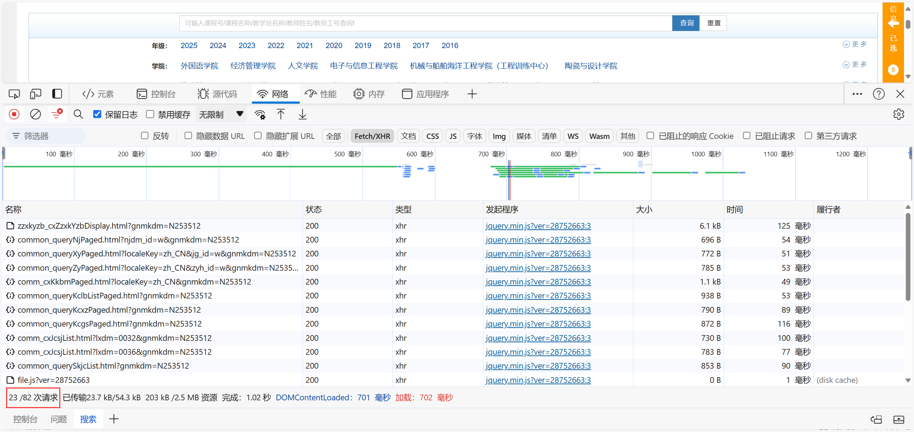

# 抢课之谜

*学校的网络真 low、能不能升级一下服务器啊、教务系统好卡啊、为什么我进不去选课界面啊、为什么别人的网速这么快啊💢……*

---

## 都是网速惹的祸

> [!note]
>
> 🤔你是否觉得网速是教务系统卡的罪魁祸首呢？
>
> 作为一名后端开发程序员，我可以很明确的告诉你：选课慢的原因有很多，但**网速其实只占了很小一部分**。

用网速慢来解释选课卡只是一个非常泛化的理解。除了网速以外，我列出几种概率最大的导致选课系统卡的原因：

### 数据库查询⭐⭐⭐⭐

根据我的经验判断，这应该是导致选课系统卡最核心的地方。

**我们来简单估算一下在选课高峰期的请求量大概是多少。**

我们就以加载选课界面的请求数来算，这是在浏览器控制台中显示的信息（在没有点击`查询按钮`的情况下）：

我们只需要留意这个参数就行了。

参数 `23 / 82` 表示加载选课页面需要 82 次请求，其中 23 次请求可能来自于数据库查询。

细心的小伙伴们应该看见了 `1.02` 秒这个参数。这表示的是页面渲染 + 网络请求等动作花费的总时间。

> [!note]
>
> 🤔为什么 82 次请求只会消耗不到 1 秒钟的时间呢？
>
> 答：因为浏览器发起的所有请求都是**异步**的。你可以泛化的理解为：这些请求不是一个一个的进行的，而是同时进行的。

**接着我们来粗略计算一下 23 次数据库查询大概会发生多少次**。

> [!note]
>
> 假设一个宿舍平均有 6 个人，如果每一个人都选课，那么**一个宿舍的请求量是 6**。
>
> 一层楼平均有 10 个宿舍（甚至更多），那么**一层楼的请求量就有 10 × 6 = 60**。
>
> 平均一栋楼有 6 层，那么**一栋楼的请求量就有 6 × 60 = 360**。
>
> 整个学校大概有 34 栋学生宿舍楼，那么**整个学校的请求量就有：34 × 360 = 12240**。

当然我这样计算是会存在很大偏差的。比如说：**不是所有人都选课，不是每个人发起的请求都是一个**……

尽管结果最终需要折中，但肯定还是会比 `12240` 这个数字大得多的。

我们就以这个数来算，那么最终数据库查询的次数可能是：**12240 × 23 = 281520**。一次数据库查询的正常时间大概是 `10 ~ 30 毫秒`。我们就以最快的 `10 毫秒`来计算。因此查询这么多次需要花费 `2815200 毫秒`，换算成`秒`就是`2815.2秒`。

所以最终的结果是：**在选课高峰期的时候，加载选课界面就至少需要花费 2815.2 秒的时间**。其中 3600 秒就是一个小时。

可想而知仅仅数据库查询就会花费这么多的时间。更不用计算 82 次请求需要花费多少时间了……

> 所以你打不开教务系统，不要老是把锅甩给网速😂。

### 服务器过载⭐⭐⭐⭐

通俗易懂的来说，服务器过载指的是：服务器不能同时处理这么请求量，当请求量到达了服务器所能承载的阈值，最终多余的请求会被直接拒绝或挂起等待。

假设教务系统服务器所能承载的最大并发数是 10000，那么 10000 以后的所有请求都会被直接拒绝或挂起等待。

各位小伙伴们在选课的时候应该经常会遇到这种情况：

这就极有可能是服务器已经不能处理这么多的请求了，它会直接将你的请求拒绝，所以浏览器才会显示这样的页面。

### 前端页面渲染⭐

不知道各位小伙伴们有没有经历过这样的情况：当你点击查询按钮的时候，浏览器会有几分钟的白屏时间。

这表示请求已经到达服务器，并且服务器正在渲染界面。所以会出现白屏的情况。这时候你只需要等待就行了🚨。

> [!note]
>
> 通常来说，界面渲染是由前端来完成的。但教务系统属于前后端不分离项目，所有的工作都由服务器来完成。

## 总结

教务系统卡顿的因素有很多很多，这里我只是列举了几个常见并且最有可能的原因。其中**数据库查询**和**服务器过载**才是导致教务系统卡的主要因素。

网速对于上面两种原因来说几乎是可以看作忽略不计的。

> [!note|label:重点❗]
>
> 不管你是在宿舍还是在图书馆。只要你连接的是校园网，那么此时你的网络和教务系统的网络是处在同一个局域网中，访问内网资源的速度是非常快的。
>
> 尽管你的浏览器一直在转圈圈，但其实这个请求已经到达了服务器，只不过是服务器还没能及时处理这次请求罢了。