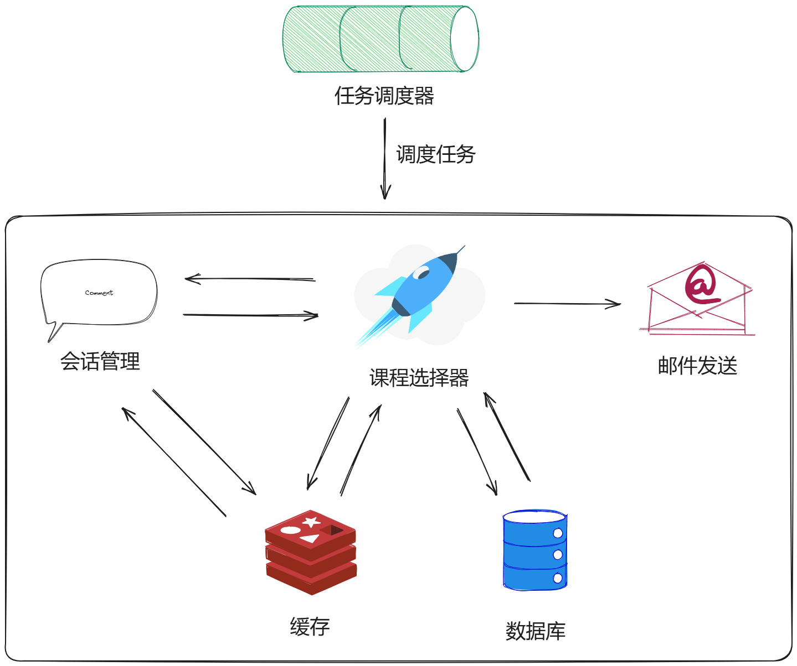

# 系统核心模块介绍

*核心模块是整个系统最为重要的部分，它保证了整个智能抢课系统的稳定运行。*

---

在前面的章节中我粗略的介绍了这个系统的前端和后端部分。但是由于它们都是这个系统的次要部分，因此我没有详细地对它们的设计逐步展开介绍。

但是，接下来的核心模块部分，是这个系统中最最重要的部分。所以我将以模块的形式来一一介绍它们。

现在，我将核心系统分为以下几个部分：

1. **课程选择器模块**
2. **数据存储模块之数据库模块**
3. **数据存储之缓存模块**
4. **会话管理模块**
5. **任务调度模块**
6. **邮件发送模块**
7. **配置模块**
8. **其他模块**

可以用下图来表示它们之间的关系：

下面，让我来一一介绍它们……