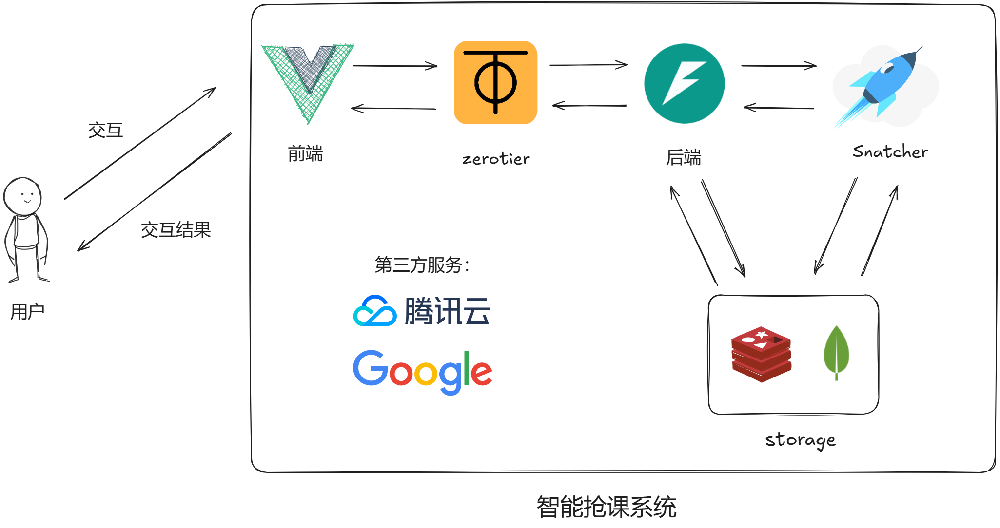
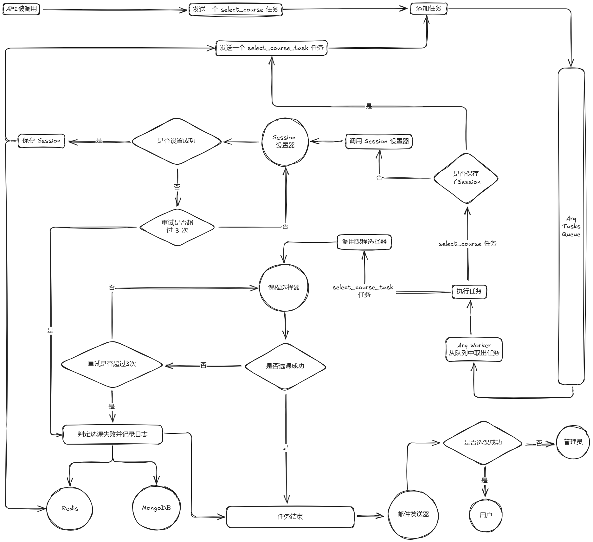
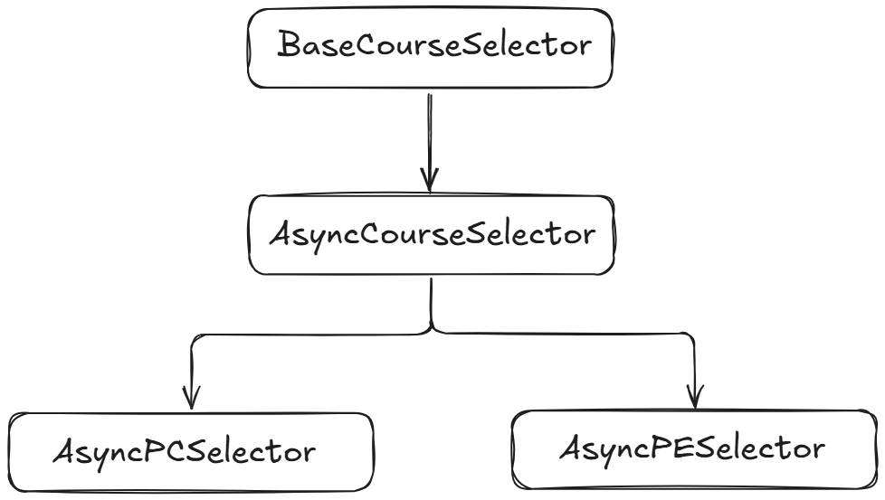
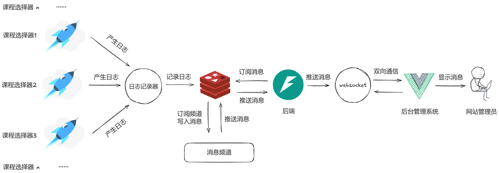
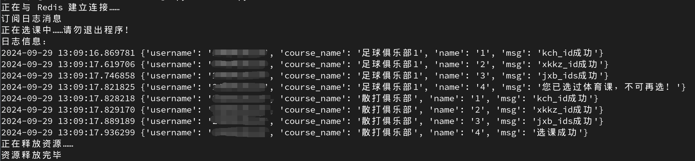
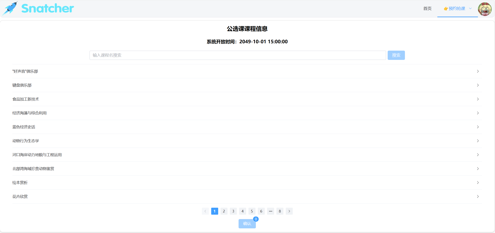
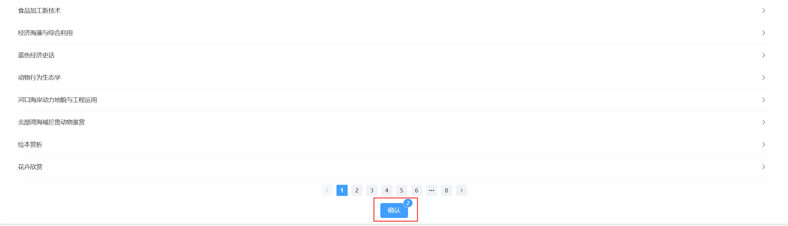
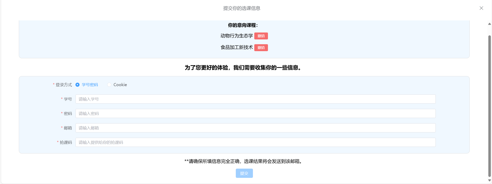

# 智能抢课系统

*代码仓库：[https://github.com/thcpdd/snatcher](https://github.com/thcpdd/snatcher)。不要忘记⭐噢。*

---

## 为什么叫智能抢课系统？

这里的 `智能` 不是因为它真的运用到了 `AI` 。而是相对于人工选课和普通代码选课来说是智能的。

你使用它是一件非常简单的事情，你只需要先选择好你的课程，然后再填写你的账号密码提交即可。你完全不需要关注它的内部是如何实现的。并且当系统选好课程之后会自动发送一封邮件告诉你课程已经选好。

因此它对于普通用户来说几乎是无门槛的。

## 它有什么特点？

1. **自动获取选课参数**

   在上面我已经提到过了，你只需要传入账号密码、意向课程就行了。剩下的工作选课系统会自己帮你完成。

2. **支持多人选课**

   内部使用了`消息队列`来**同时**处理多个选课任务。**所以你完全不需要担心需要排队选课的问题**。

3. **内部自动处理异常**

   这是在代码层面的工作，这里不多介绍。

上面 3 点是普通代码选课所面临的缺陷，智能抢课系统都逐个解决了。

那么下面几点是选课系统额外的亮点：

1. **易于普通用户使用的操作界面**

   这点是最重要的。我曾以 `正方` 、 `抢课` 、 `选课` 等等的关键字在 `GitHub` 上检索相关信息。但最终翻遍了整个 `GitHub`，都没有找到一个易于普通用户使用的抢课系统。

2. **支持提前提交选课任务**

   即使还没到选课时间，你也可以在系统上提交选课任务，因为系统内部会自动判断当前时间是否是选课时间。

3. **支持查询选课进度**

   当你在系统上提交了你的选课申请，那么当选课开始时，系统内部会记录每一步选课动作，你可以通过系统提供的接口来查询你的选课进度。

4. **后台可监听所有选课任务进度**

   这个功能对于网站管理员来说是尤为重要的，系统管理员可以以一个上帝视角去实时查看所有的选课进度。

5. **显示课程的已选择人数**

   如果你急切地想看到意向课程的选课情况，并且又进不去教务系统。那么不用担心，系统内部会每隔一段时间从教务系统中获取课程的已选择人数，并展示到系统的相关页面。

6. **不使用账号密码也能选课**

   如果你不想泄露你的密码，那么抢课系统也提供了一个不用密码的抢课渠道。

## 系统设计思路

+ ### 系统调用原理

  

+ ### 核心功能设计

  

  在这里简单描述一下：

  1. 在选课 API 被调用之前，系统会提前挂起一个的任务队列进程，该进程用于监听选课 API 提交的任务。
  2. 在 API 被调用之后，`Arq-Worker`会监听到有任务被提交，于是将任务从队列中取出。
  3. 当任务被取出之后，假如任务类型是`select_course`，那么首先会检查`Redis`中是否包含用户对应的会话。如果没有，系统会主动地去保存会话（如果会话设置失败，任务会直接结束）。接着获取选课的时间，最后将选课任务再次发送到任务队列。
  4. 当到达任务设定的时间之后，`Arq-Worker`会不断的从任务队列中取出并执行任务。
  5. 当任务被执行后，调用相应的课程选择器来进行选课操作，期间任意一个关键步骤失败都会记录失败信息，失败后会重试。当到达最大重试次数后（这里设置的是 3 次），直接判定选课失败。
  6. 最后整个任务执行完毕。

+ ### 课程选择器设计思路

  课程选择器的本质其实就是一个爬虫程序，只不过就是经过反复抽象，最终成为了一个可扩展性非常强的课程选择器类。

  在`/snatcher/selector/base.py`下，定义了一个名为`BaseCourseSelector`的类，它是所有课程选择器类的父类。在这个类中定义了一个课程选择器应有的属性的抽象方法。

  这个类派又生出一个类：`AsyncCourseSelector`，异步课程选择器类。

  这个类所处的文件目录为：`/snatcher/selector/async_selector.py`。它表示所有发送请求使用的库都是`aiohttp`。所有代码逻辑都是异步非阻塞的。

  它定义了一个异步选择器类的通用方法，接着它又派生出了两个重要的类：

  1. `AsyncPCSelector`：公选课选择器类，专门用于实现公选课选课逻辑。
  2. `AsyncPESelector`：体育课选择器类，专门用于实现体育课选课逻辑。

  下图是它们之间的继承关系：

  

+ ### 日志监听原理

  整个日志的创建与监听都是围绕 `Redis` 的`发布-订阅`模型展开的。

  

+ ###  解耦式开发思想

  所谓“解耦”，就是低耦合。表示每个模块或者功能之间没有太多的依赖关系，每个模块或者功能单独拿出来也能够正常使用，提高了模块或者功能的可复用性。

  例如本项目中的课程选择器，单独拿出来也是可以使用的；还有`snatcher`整个包，不需要依赖前端的调用，手动调用也完全可以实现对应的功能，它提供了一个统一的对外接口，以至于让所有的 Python 程序都能够轻松的调用它。

  其实`snatcher`可以完全脱离前端和后端使用，只不过为了让这个系统对外部调用者显得更加友好，所以最终决定以 Web 的形式呈现到用户的眼中，同时也提高了整个系统的安全性。

## 快速上手

首先，你需要提前准备好这些东西：

1. 意向课程名字（这个可以随便取名字）
2. 意向课程对应的课程号 ID（kch_id）
3. 意向课程对应的教学班 ID（jxb_id）

上述参数都可以在教务系统中拿到，可以自己研究一下。

准备好了嘛？那就开始吧！😊

###  项目基本环境依赖

1. `Redis`：确保你的电脑已经安装了`Redis`，并且版本建议在 5.0 以上。它在项目中发挥了至关重要的作用。
2. `Python`：安装 `Python` 环境，项目所依赖的 `Python` 版本必须 大于等于 `Python 3.10`。

### 构建项目

1. 将项目的主支从 `GitHub` 中下载到本地。

   ```bash
   git clone https://github.com/thcpdd/snatcher.git -b master
   ```

2. 进入项目根目录

   ```bash
   cd ./snatcher
   ```

3. 创建并激活虚拟环境

   ```bash
   python -m venv ./venv  # 创建虚拟环境
   # 激活虚拟环境
   .\venv\Scripts\activate  # Windows系统
   source ./venv/bin/activate  # Linux系统
   ```

4. 安装项目所需依赖

   ```bash
   pip install -r requirements.txt
   ```

5. 更改项目配置信息

   首先打开 `./snatcher/conf.py` 文件。

   在文件中你会看到 `Settings` 这个类，里面的类属性是整个项目的所有配置信息。

   你现在需要留意以下 3 个配置：

   1. **TERM**：选课学期，整数类型。上学期填 3，下学期填 12。
   2. **SELECT_COURSE_YEAR**：选课学年，整数类型。无论是上学期还是下学期，都填写上学期的年份。例如，假设选课时间是 2025 年 4 月份，要填的就是上学期的年份 2024；假如选课时间是 2024 年 10 月份，那么当前学期就是上学期，直接填 2024 就行了。
   3. **START_TIME**：开始选课的时间，字典类型。按照键的名字来填就行了。

   **注意，请务必将上述信息完全填写正确，否则将会影响选课。**

### 调用系统工具

项目内部向外提供了一个极其简单的调用方式。

首先，在项目的根目录下创建一个 `Python` 文件并写入以下内容：

```python
from snatcher.selector import SimpleSelectorPerformer, AsyncPESelector

goals = [
    ('足球俱乐部1', '1BB2143990AF721DE0630284030A2394', '1B4A6FAFDEC4AEF0E0630284030AD355'),
    ('散打俱乐部', '1C661CABC37FA592E0630284030A735A', '1B398450EB7C2B44E0630284030A0D78')
]
username = '你的学号'
password = '你的密码'

performer = SimpleSelectorPerformer(username, password, AsyncPESelector, goals)
performer.perform()
```

这段代码描述了一个体育课选课的基本调用过程，下面是对每一行代码或变量的解释：

- **第一行导包**：导入项目内部的工具，这里就不多解释了。
- **SimpleSelectorPerformer**：简单课程选择器执行器，它封装了一个课程选择器调用的基本方式，并且内部自带日志输出，你可以理解为它是一个“迷你智能抢课系统”。
- **AsyncPESelector**：异步体育课选择器，整个类封装了完整的体育课选课逻辑。如果是公选课，那么你需要将类名中的 “E” 改为 “C” 即可。
- **goals**：你的意向课程列表，每一个列表元素都是一个由 (课程名字、课程号ID、教学班ID) 构成的三元组。课程选择器会**按顺序**的尝试选择每一个课程，假如第一个课程失败了，那么它会尝试后面的课程，直到列表遍历完毕……
- **username**：你的学号。
- **password**：你的密码。
- **performer**：执行器的实例化对象。注意，传入的 `AsyncPESelector` **课程选择器不需要加括号**❗并且**不要尝试手动调用课程选择器**❗除非你对其内部原理足够了解。
- **performer.perform()**：调用内部方法并执行选课逻辑。

执行上述代码会发生什么？

1. 自动模拟登录并保存登录状态。
2. 自动执行选课逻辑。
3. 期间会连接 `Redis` 并不断输出日志信息。

确保输入参数正确并**在选课开始时**运行这个 `Python` 文件，你将会看到类似于以下的内容：



整个过程仅仅花费了一秒钟左右的时间。当然，在选课期间日志的输出并不会这么频繁。也有可能会输出别的信息，比如重试、异常等等……但这些都不需要你自己处理，系统内部会自动帮你处理这些问题。

### 小技巧

在上面提到执行了上述代码会自动模拟登录，但模拟登录的过程可以在选课之前完成。例如，在一个 `Python` 文件中写入以下内容：

```python
import asyncio
from snatcher.session import async_check_and_set_session

username = '你的学号'  # 请用真实信息替换它
password = '你的密码'  # 请用真实信息替换它

coroutine = async_check_and_set_session(username, password)
asyncio.run(coroutine)
```

运行上述代码，系统内部会自动帮你提前登录好并保存登录状态（请确保提前登录的时间和选课的时间在同一天）。这样在调用选课逻辑的时候可以跳过登录步骤，直接进入到选课阶段，进而大大提高选课的速度。

> [!attention|label:注意❗]
>
> 导入的`async_check_and_set_session`函数不是一个普通的函数，它是一个`协程函数`，手动调用它并不会直接执行函数内的逻辑，而是返回一个`协程对象`，这个对象需要交给`事件循环`来调度。正如上述代码的最后一句话。

以上就是快速上手项目的所有内容了，如果你想启动整个项目，你可能需要花不少时间把整个项目吃透，才有可能将每个组件成功启动。

## 普通用户如何使用？

1. **先进入系统的选课界面**

   

2. **找到相应课程并点击添加**

   

   > 可以添加多个课程，系统会按照添加顺序来一一选课。

3. **点击下方确认按钮**

   

4. **输入相关信息**

   

   > [!tip|label:说明]
   >
   > **登录方式**：如果你想使用第二种方式，那建议你先提前联系网站管理员。
   >
   > **抢课码**：联系管理员获取。

5. **提交**

   确认信息无误后即可提交。

