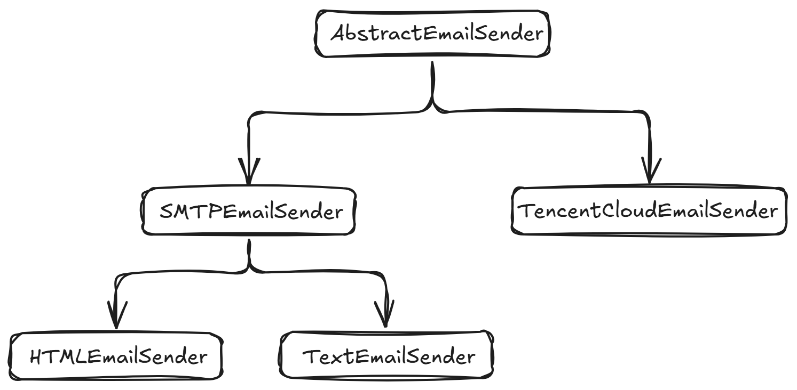

# 邮件发送模块

*该模块用于通知用户选课成功、将选课失败的信息告知管理员。*

---

其实在 Python 的标准库中自带了邮件发送模块，只不过在这个项目中进一步对这些模块做了一个封装。

邮件发送模块位于：`/snatcher/postman/mail.py` 下。

该模块基于邮件发送器（类）展开，这是各个邮件发送器之间的继承关系：

- **AbstractEmailSender**

  抽象邮件发送器，这个类只定义了一个抽象方法 `send`，这表示所有的邮件发送器都要继承它，并实现 `send` 方法。

- **SMTPEmailSender**

  基于 `SMTP` 协议的邮件发送器，所有发送的邮件都是经过 `SMTP` 服务器的。

- **HTMLEmailSender**

  是 `SMTP` 邮件发送器的子类，专门发送 `HTML` 类型的邮件。

- **TextEmailSender**

  是 `SMTP` 邮件发送器的子类，专门发送 `Text` 类型的邮件。

- **TencentCloudEmailSender**

  直接继承于抽象邮件发送器，它表示所有的邮件发送都是由腾讯云来发送。

  我选择使用腾讯云服务来发送邮件的原因是：如果直接使用 `SMTP` 来发送邮件，那么这会存在一个限流问题，这导致之前在测试的时候，很多邮件都发送失败了。

  尽管使用腾讯云服务来发送邮件也会有一个限流，但是这相对于使用 `SMTP` 来发送邮件已经很好了。

> [!tip|label:这些邮件发送器都在什么时候使用呢？]
>
> - 如果是选课失败的邮件，那么都会使用文本类型的邮件发送器发送邮件。
> - 如果是选课成功的邮件，并且在配置文件中指定了使用腾讯云来发送邮件，那么就会使用腾讯云邮件发送器；否则使用超文本标记语言邮件发送器。

针对这么多情况的选择，这里使用了设计模式中的`工厂方法模式`来获取符合条件的邮件发送器。

它位于该模块下的 `EmailSenderFactory` 类。

为了让其他模块更方便地使用邮件发送功能，这里统一定义了一个函数：`send_email`。

这个函数可以根据传入的参数来自动判断应该调用的邮件发送器来发送邮件。

因此你不需要自己调用那些邮件发送器，你只需要调用这个函数就可以很方便地发送邮件了。