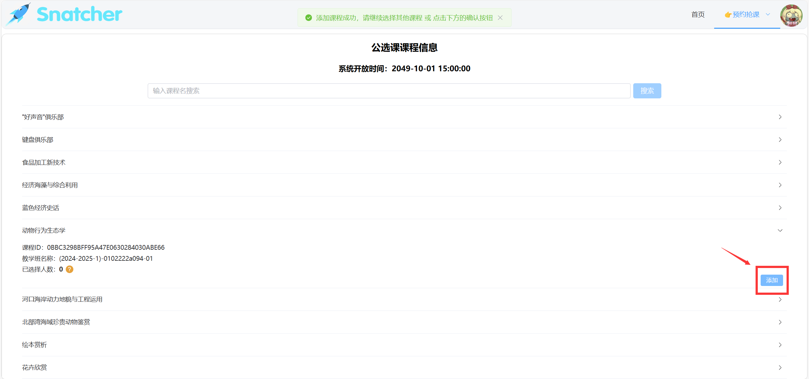
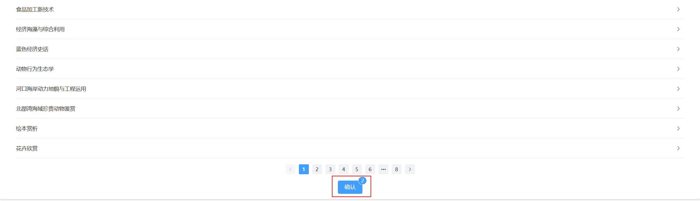

# 智能抢课系统

*代码仓库：[https://github.com/thcpdd/snatcher](https://github.com/thcpdd/snatcher)。不要忘记⭐噢。*

---

## 为什么叫智能抢课系统？

这里的 `智能` 不是因为它真的运用到了 `AI` 。而是相对于人工选课、普通代码选课来说是智能的。

你使用它是一件非常简单的事情，你只需要先选择好你的课程，然后再填写你的账号密码提交即可。你完全不需要关注它的内部是如何实现的。并且当系统选好课程之后会自动发送一封邮件告诉你课程已经选好。

因此它对于普通用户来说几乎是无门槛的。

## 它解决了什么问题？

>  如果你是从上一章过来的小伙伴，那么你应该知道这个问题怎么回答。

1. **自动获取选课参数**

   在上面我已经提到过了，你只需要传入账号密码、意向课程就行了。剩下的工作选课系统会自己帮你完成。

2. **支持多人选课**

   内部使用了`消息队列`来**同时**处理多个选课任务。**所以你完全不需要担心需要排队选课的问题**。

3. **内部自动处理异常**

   这是在代码层面的工作，这里不多介绍。

上面 3 点是我之前提到的普通代码选课所面临的缺陷，智能抢课系统都逐个解决了。

那么下面几点是选课系统额外的亮点：

1. **易于普通用户使用的操作界面**

   这点是最重要的。我曾以 `正方` 、 `抢课` 、 `选课` 等等的关键字在 `GitHub` 上检索相关信息。但最终翻遍了整个 `GitHub`，都没有找到一个易于普通用户使用的抢课系统。

   > [!tip]
   >
   > 在我看来，既然尝试做了某件事情，那么就要把做这件事的结果友好的展现在人们的眼中。

2. **支持提前提交选课任务**

   即使还没到选课时间，你也可以在系统上提交选课任务，因为系统内部会自动判断当前时间是否是选课时间。

3. **支持查询选课进度**

   当你在系统上提交了你的选课申请，那么当选课开始时，系统内部会记录每一步选课动作，你可以通过系统提供的接口来查询你的选课进度。

4. **后台可监听所有选课任务进度**

   这个功能对于网站管理员来说是尤为重要的，系统管理员可以以一个上帝视角去实时查看所有的选课进度。

5. **显示课程的已选择人数**

   如果你急切地想看到意向课程的选课情况，并且又进不去教务系统。那么不用担心，系统内部会每隔一段时间从教务系统中获取课程的已选择人数，并展示到系统的相关页面。

6. **不使用账号密码也能选课**

   如果你不想泄露你的密码，那么抢课系统也提供了一个不用密码的抢课渠道。

## 如何快速上手项目？

> 这里的快速上手，指的是使用系统内部的工具完成选课，不是将整个系统启动。如果你对内部的实现细节感兴趣，那么也可以联系我。

在这之前，请你先确保本地拥有系统能够运行的环境：

- `Python`，版本必须大于等于 3.11。
- `Redis`，版本没有具体要求。

1. **将代码克隆到本地**

   ```bash
   git clone https://github.com/thcpdd/snatcher.git
   ```

   > 除了使用 `Git` 命令克隆代码外，你还可以到代码仓库上面直接下载代码的压缩包。

2. **进入项目目录**

   ```bash
   cd ./snatcher
   ```

3. **为系统创建并激活虚拟环境**

   ```bash
   # 创建
   python -m venv ./venv
   # 激活
   .\venv\Scripts\activate  # Windows系统
   source ./venv/bin/activate  # Linux 或 MacOS 系统
   ```

   > [!tip|label:虚拟环境]
   >
   > 它相当于为这个项目单独创建了一个 `Python` 环境，在这个环境内的所有操作都不会影响到全局的 `Python` 环境。

4. **安装系统的依赖**

   ```bash
   pip install -r ./requirements.txt
   ```

   > [!tip|label:切换镜像源]
   >
   > 如果下载速度慢的话，可以在命令行后面增加一个参数：`-i https://pypi.tuna.tsinghua.edu.cn/simple`
   >
   > 但是这样只起到一个临时效果，如果你想要永久生效，那么你应该使用这条命令，之后所有的安装都会使用该镜像源：
   >
   > `pip config set global.index-url https://pypi.tuna.tsinghua.edu.cn/simple`

5. **调用课程选择器**

   先项目根目录中创建一个 `Python` 文件，然后写入以下内容：

   ```python
   import asyncio
   from snatcher.selector.async_selector import AsynchronousPublicChoiceCourseSelector
   from snatcher.session import async_check_and_set_session
   
   username = '你的学号'
   password = '你的密码'
   log_key = '日志名称'  # 可以随意写
   goals = [('课程名1', '课程号ID1', '教学班ID1'), ('课程名2', '课程号ID2', '教学班ID2')]
   
   async def main():
       res = await async_check_and_set_session(username, password)
       if res == -1:
           print('登录失败')
           return
       async with AsynchronousPublicChoiceCourseSelector(username) as selector:
           for course_name, course_id, jxb_id in goals:
           	await selector.update_selector_info(course_name, course_id, jxb_id, log_key)
                code, message = await selector.select()
                if code == 1:
                   print('选课成功')
                   return
   		    print('选课失败，失败信息：', message)
    
   asyncio.run(main())
   ```

   上面的代码是一个公选课选择器的调用函数，同时系统内部也是类似于这样调用的。

   > [!tip|label:课程选择器]
   >
   > 在系统内部，定义了课程选择器类，所有的选课逻辑都由选择器类完成。

   > 原先抢课系统支持公选课和体育课，但由于教务系统的原因，现在只支持公选课。

   在代码中的 `AsynchronousPublicChoiceCourseSelector` 是一个公选课课程选择器，它是一个类，同样也是一个异步上下文管理器。要使用选择器，必须像上面那样创建它，然后更新选择器信息，最后调用 `select` 方法。

   > [!tip|label:上下文管理器]
   >
   > 系统内部的很多地方都用到了上下文管理器，有了它，可以很轻松的对资源的创建和释放进行管理。

## 普通用户如何使用？

1. **先进入系统的选课界面**

   

2. **找到相应课程并点击添加**

   

   > 可以添加多个课程，系统会按照添加顺序来一一选课。

3. **点击下方确认按钮**

   

4. **输入相关信息**

   

   > [!tip|label:说明]
   >
   > **登录方式**：如果你想使用第二种方式，那建议你先提前联系网站管理员。
   >
   > **抢课码**：联系管理员获取。

5. **提交**

   确认信息无误后即可提交。

