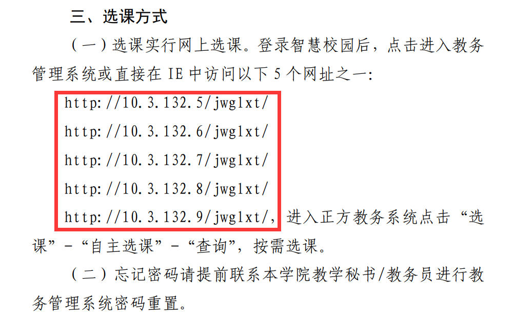
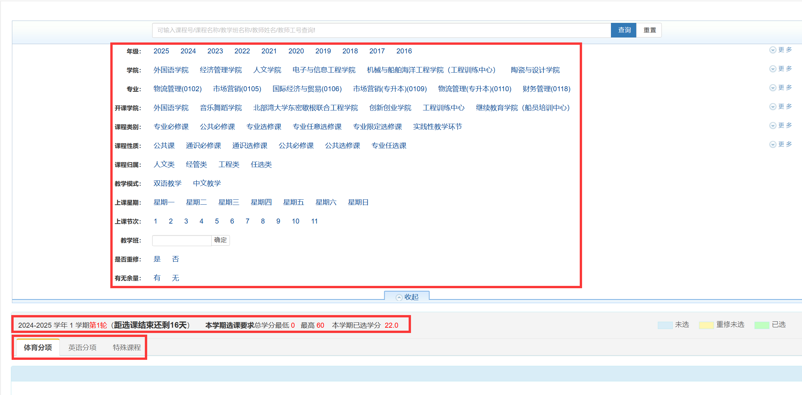
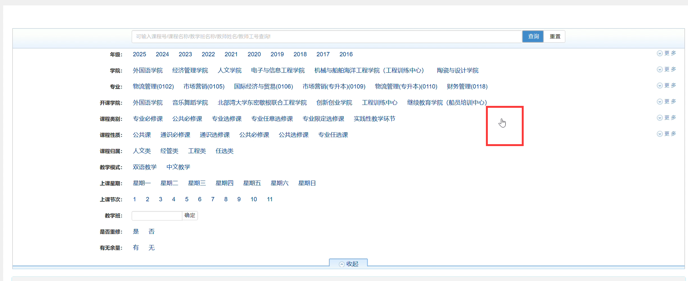

# 抢课“小技巧”

🤔*为什么你总是选不到课？为什么代抢课能够抢到课？他们究竟是怎么做到的？*

---

## 来自选课文件的提示

任意打开一个选课通知文件，你应该都能看到以下内容：

这里我把这些网址都列出来：

- [http://10.3.132.5/jwglxt/](http://10.3.132.5/jwglxt/)
- [http://10.3.132.6/jwglxt/](http://10.3.132.6/jwglxt/)
- [http://10.3.132.7/jwglxt/](http://10.3.132.7/jwglxt/)
- [http://10.3.132.8/jwglxt/](http://10.3.132.8/jwglxt/)
- [http://10.3.132.9/jwglxt/](http://10.3.132.9/jwglxt/)

它是在告诉我们，进入教务系统的方式有很多，你可以通过上面的任意网址进入教务系统。

> [!tip|label:每个网址之间的规律]
>
> 细心的小伙伴们应该发现了其中的规律🔍：每一个网址都只有一位数字不一样。我们暂且把这位数字称为`主机号`。

那主机号不同又意味这什么呢？是不是意味每一个主机号对应了一台服务器呢？

> [!warning|label:猜想]
>
> 我也只是猜测罢了，毕竟我也不知道其中技术的实现细节。

现在，我在**同一个浏览器上面**打开主机号分别为 5 和 6 的两个网址。各位小伙伴们也可以按照下面的步骤一起来试试。

1. 首先在主机号为 5 的教务系统上面登录。
2. 切换到主机号为 6 的网址，然后刷新页面。
3. 你会发现主机号为 6 的网页没有影响，还是处于未登录状态。
4. 接着在主机号为 6 的网址上面进行登录。
5. 切换到主机号为 5 的网址，刷新页面。
6. 这时你又会发现主机号为 5 的网址没有被踢下线。

此时你可以用别的网址也这样试试，你会发现每一个网址的登录操作都不会影响别的网址。

> [!note|label:总结]
>
> 不同网址之间**分别**维护了一个**独立的登录状态，这些登录状态互不干扰**。

换句话说：**我是不是可以用多个网址同时选课呢？**

没错，恭喜你发现了其中的奥秘。🎉🎉🎉

## 将这个奥秘运用到选课上

要使用这个技巧，你必须同时具备以下条件：

1. 处于校园网（校园网、电信、移动、联通均可）连接状态下的一台设备。
2. 能直接使用学号密码登录教务系统（通过微信扫码登录的不行）。

话不多说，直接开始。💪

- ### 提前登录好教务系统并进入选课界面

  你需要在选课开始前的半个小时，在**同一浏览器中**任意进入 `2 ~ 3` 个上面提到的网址（你也可以登录更多的网址，但你得确保你能忙的过来）。将它们都登录好，并进入选课界面（即使没有开始选课，也要先进入选课界面）。

  > [!warning]
  >
  > 为什么我一直强调要在同一个浏览器中？
  >
  > 答：假设你使用浏览器 1 登录了主机号为 5 的网址；接着你在浏览器 2 也登录这个网址，那么浏览器 1 的登录状态会失效，账号会被踢下线。这是需要注意的地方。

- ### 选课开始时，刷新每个网址的选课页面

  这里需要注意的是：每个页面的刷新**只点一次**，然后你就静静的看着浏览器转圈圈吧😂……

  > [!warning]
  >
  > 为什么这里要强调只点一次呢？
  >
  > 答：在 [抢课之谜](/snatcher/mystery) 的最后我已经说过了。虽然浏览器在转圈圈，但你发出的请求很可能已经到达了服务器中。如果你再次刷新的话，请求不仅会再发送一次，而且第一次请求还会直接取消。如果此时服务器已经过载，那么你第二次发起的请求很有可能会被**直接拒绝**或者**进入排队等待状态**。**下面的所有操作亦是如此，还望小伙伴们多加注意**。

- ### 选课界面加载完毕的时候，点击查询按钮

  这里有几个需要注意的点：

  1. **什么时候选课界面加载完毕**？

     这里我给出一个图例：

     

     你可以检查红色方框中的字是否已经**全部显示出来**，如果已经全部显示，那么就证明你可以进行下一步了。

     > [!warning]
     >
     > 如果这些字没有全部加载出来，你会发现你点击查询按钮是无效的。

  2. **切换到相应的课程类型**

     例如你是公选课，那么就选择公选课类型，以此类推……并且**只点击一次**❗

  3. **如何点击查询按钮使得数据库查询更加高效**？

     当界面加载完毕的时候，不必着急点击查询按钮，我们要适当添加一些查询条件，包括但不限于以下：

     1. 课程名其中的关键字
     2. 课程号
     3. 教学班名称
     4. ……

     比如你想选择的课程名称是《现代礼仪》，那你大可以搜索 `礼仪` 两字，因为这样被检索出来的概率是最大的。

  4. **点击查询按钮后**

     如果你已经点击了查询按钮，那么鼠标应该会处于`点击`状态，并且页面是卡住的。如下图：

     

     如果查询是有效的，那么不管鼠标放在页面的哪个位置，都是这样的状态；否则就说明你的查询无效。

     如果是这种状态，那么页面可能会有几分钟的白屏时间，这是正常现象。你只需要等待就可以了。

- ### 点击选课

  如果你熬到了这里，那么你应该大概率是能够选到课程了的。

## 这样做的好处和坏处

### 好处

好处非常明显，就是可以更快的帮你选到课程🥳。

### 坏处

这样做也有一些很不好的地方，这里列举了以下几点：

1. #### 增加数据库压力

   虽然系统开放了这么多网址供你访问，这在某种程度上实现了`负载均衡`。

   > [!tip|label:负载均衡]
   >
   > 所谓的负载均衡，就是指：可以将所有流量分摊到不同的服务器上，以提高系统的并发量和吞吐量。

   但是，不知道小伙伴们有没有考虑过这样一个问题：**假如所有的网址都是用同一个数据库呢**？

   虽然提高了服务器的并发量，但是数据库是否能够承受这么高的并发量呢？

   如果数据库抵抗不了这么高的并发量，最终还是会导致网站卡顿……

2. #### 增加服务器压力

   首先我抛出一个问题：**不同网址一定对应了不同的服务器吗**？

   在以下几种场景下，多个 IP 地址并不一定代表不同的物理服务器：

   1. **同一服务器的多网卡配置**：一台服务器可能配置多个网卡，每个网卡都对应不同的 IP 地址，这些 IP 地址指向同一台服务器。
   2. **负载均衡**：有可能这些 IP 地址是负载均衡器分配给不同的后端服务器，通过负载均衡器来分发流量。例如，通过轮询或其他算法决定将请求转发到哪一台服务器。
   3. **虚拟化环境**：在虚拟化或容器环境中，一台物理服务器可能运行多个虚拟机或容器，每个虚拟机或容器都有独立的 IP 地址。

   所以，这可能也会增加服务器的压力，导致网站响应时间过长。

3. #### 不利于别的同学选课

   看到这里，可能有的小伙伴会说：<u>我自己的选不到课了，我哪还能顾得上别人啊😂。</u>

   这里的`别的同学`指的是不知道抢课技巧的同学。

   其实大家选课都难，何不相互退让退让呢是吧。

   > [!attention|label:我的建议]
   >
   > 我还是建议不要无脑的同时打开这么多网址，其实你用其中一个网址就足够了。因为我平常帮小伙伴们选课也是只要其中一个网址就能选到了。

最后我想说：“只要你稍微有点耐心，你会发现其实选课是非常简单的。不要老是觉得自己网速没有别人快，我相信屏幕前的你看到这里，应该不会有这种想法了吧！”

> [!tip|label:番外篇]
>
> 如果屏幕前的你是计算机相关专业，并且有着较好的编程水平，那么你可以继续浏览下一章。
>
> 当然，如果你感兴趣的话，还可以了解了解 [智能抢课系统](/snatcher/snatcher-system) 。
