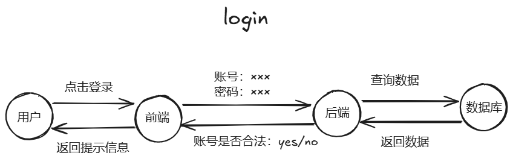

# 网站知识小科普

*考虑到这份文档将来是面向大众的，因此为了能让大家更好的理解我下面所说的内容，我先为小伙伴们做一些网页相关知识的小科普。*

---

> [!tip]
>
> 如果你是计算机专业相关的同学，或者说你对这方面已经有了一个初步的了解，那么你也可以直接跳到下一部分（👉[抢课之谜](/snatcher/mystery)）。

## 网站的基本组成部分

首先，绝大多数情况下，一个网站会分为以下部分：

- #### 前端

  字如其名，所谓的前端就是放在最前面的东西。**你打开一个网页见到的所有东西都是属于前端部分**，它主要负责将服务器的数据通过 `美化` 最后 `展示` 到用户的眼中。

  前端除了展示数据以外，还会有一系列的权限校验、数据校验等等……

  > [!note]
  >
  > 🤔前端的数据数据是从哪里来的呢？
  >
  > 答：前端通过某种交互方式从后端获取数据。

- #### 后端

  后端除了向前端提供各种数据以外，它还是网站的最后一道防线，所有不合法的输入即使侥幸逃过了前端的检查，那么后端还是会将这些不合法的输入排除在外❌……

  一个通俗的理解是：假如你需要使用微信支付功能，那么在支付的过程中，你通常需要先进行权限校验。它**包括但不限于**：密码验证、人脸验证、指纹验证等等。**这个验证的过程都是由后端完成**，前端通常不会参与验证的过程。

  > [!note]
  >
  > 后端是怎么知道密码是否正确的呢？
  >
  > 答：后端还会与数据库进行交互，它从数据库中获取相关信息，并将输入信息与数据库中的信息进行对比。

- #### 数据库

  大家听它的名字应该会有所了解，它是**存储网站所有数据的集合**。你在教务系统中浏览到的所有数据都来自它，所以它是一个网站最最核心且最底层部分。

  > [!note]
  >
  > 当然，有的网站既没有后端也没有数据库，这说明这个网站很小，完全不需要依赖它俩。**这是一种极为少数的特殊情况**。就比如说当前站点的顶级站点：[戳我打开](https://www.thcpdd.com)

## 网站的请求与响应

大家都使用过网站的登录功能，那么我就以这个最简单的功能来将上面的知识全都串起来。

*我简单的画了一个草图，大家可以参考草图看文字。*

1. 假设你已经在教务系统的登录页面输入了账号和密码，那么这时候你会点击登录按钮。

2. 当你点击了登录按钮，前端会通过**网络传输**的方式将账号和密码告诉后端。

3. 后端拿到了账号密码之后，它会知道前端需要执行登录逻辑，于是它又通过**网络传输**的形式与数据库交互，并从数据库中获取真实数据与当前数据对比。

   > [!warning]
   >
   > 数据库的数据是保存在磁盘中，所以数据库要查询数据，是需要先从磁盘（硬盘）中将数据加载到内存，再在内存中将数据通过**网络传输**返回给后端。
   >
   > 从磁盘中读取数据的过程也是一个非常耗时的操作❗
   >
   > **网络传输、读取磁盘数据**等，你都可以理解为耗时操作。

4. 接着后端将对比结果又一次通过**网络传输**告诉前端。

5. 最后前端将结果展示到用户的眼中。

通过上面的简单说明，你应该可以感受到整个**请求与响应的过程是一个非常漫长的过程**（对于计算机来说😂），因为期间涉及到了很多次耗时操作。

大家也可以自行推断一下哪一个耗时操作对于选课来说最为重要呢？

> [!tip]
>
> 如果你已经看完了这部分，那么你对接下来的内容应该不会很吃力了。
>
> 大胆的点击下一章节吧！💪